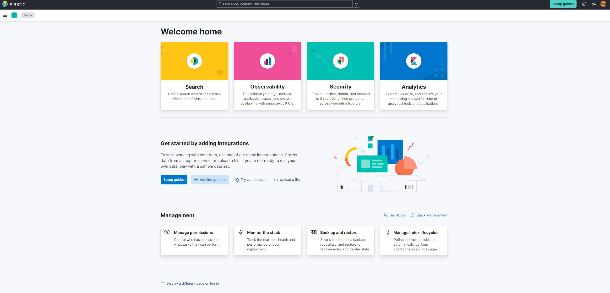

# Create an Homelab with Elastic Siem 

In this section, I will walk you through setting up a home lab for Elastic Stack SIEM using the Elastic Web portal and a Kali VM. You will learn how to create some security events on the Kali VM, set up an agent to forward data to the SIEM, and query and analyze the logs in the SIEM

# Prerequisites
 - Virtualbox with Kali installed on it
 - Basic Knowledge of Linux and virtualization software

# Tasks
- Install a Virtual Machine
- Create an Elastic account
- Configure and install Elastic Agent integration on the Linux VM to collect all the logs and forward it to the SIEM
- Create a Dashboard to visualize security events.
- Create Alerts for security events
- Generate secutiry events on the VM

# Tasks 1 : Create an Elastic Free Account

- Sign up for a free trial to use Elastic Cloud
- Login into the Elastic Cloud console
- Click on "start your free trial
- Click on "Create Deployment" and then select "Elasticsearch" as a type of Deployment"
- Once the deployment is ready , click "continue"

# Tasks 2 : Setting up Kali Linux Machine
At this point we need to set up the VM. To do that we need to follow these steps :
- Download the Kali Linux VM from the official site
- Create a new VM with the Kali VM file in your preferred virtualization platform, such as VirtualBox or VMware.
- Start the VM and follow the on-screen prompts to install the VM.
- Once the installation is complete, log in to the Kali VM using the credentials “kali” for both the username and password.

# Tasks 3 : Setting up Elastic Agent Integration for log collecting
Now we are going to install the Elastic Agent Integration. This integration is a software program that is installed on a device , such an endpoint, to collect and send data to a centralize sistem (SIEM) for analysis and monitoring. 

